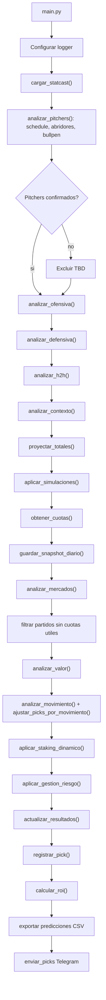
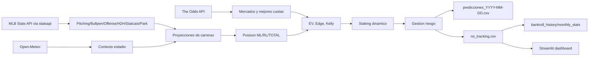
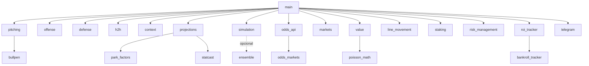

# Arquitectura

## Vision general

El sistema es un pipeline batch diario para MLB. Su unidad de trabajo es una lista de diccionarios `partidos`; cada modulo enriquece esos diccionarios con nuevas claves hasta llegar a picks, riesgo, tracking y salida.

No hay framework de dominio formal ni base de datos. La arquitectura es procedural/modular, con persistencia por CSV/JSON y caches en `output/`.

## Capas del sistema

1. Orquestacion: `main.py`.
2. Ingestion deportiva MLB: `analysis.pitching`, `analysis.bullpen`, `analysis.offense`, `analysis.defense`, `analysis.h2h`, `analysis.statcast`, `analysis.park_factors`.
3. Contexto externo: `analysis.context` para clima/hora local.
4. Proyeccion/simulacion: `analysis.projections`, `analysis.simulation`, `analysis.ensemble` opcional.
5. Mercado de apuestas: `data.odds_api`, `data.odds_markets`, `analysis.markets`, `data.line_movement`.
6. Evaluacion de valor: `analysis.value`.
7. Staking/riesgo: `bankroll.staking`, `utils.risk_management`.
8. Tracking/rendimiento: `tracking.roi_tracker`, `bankroll.tracker`, `backtesting.backtesting`, `dashboard.roi_dashboard`.
9. Observabilidad/notificacion: `utils.logger`, `notifications.telegram`, `logs/`.

## Flujo de ejecucion diario

## Flujo de datos

## Modelo de datos implicito

El `partido` es un `dict` mutable. Claves principales por etapa:

- Inicial: `home_team`, `away_team`, `home_pitcher`, `away_pitcher`, `home_stats`, `away_stats`, `home_bullpen`, `away_bullpen`, `start_time`, `venue_name`, `pitchers_confirmados`.
- Ofensiva/defensa/H2H/contexto: `home_offense`, `away_offense`, `home_defense`, `away_defense`, `h2h`, `contexto`.
- Proyeccion/simulacion: `proj_home`, `proj_away`, `proj_total`, `park_factor_usado`, `prob_home_win`, `prob_away_win`, `rl_home_prob`, `rl_away_prob`.
- Mercado: `cuota_home`, `cuota_away`, `cuota_rl_home`, `cuota_rl_away`, `linea_rl_home`, `linea_rl_away`, `cuota_over`, `cuota_under`, `linea_total`, `odds_markets`, `odds_best`.
- Valor/riesgo: `pick_ml`, `valor_ml`, `edge_ml`, `stake_pct_ml`, `pick_rl`, `valor_rl`, `edge_rl`, `stake_pct_rl`, `pick_total`, `valor_total`, `prob_total`, `stake_pct_total`, `mejor_pick`, `data_quality_flags`, `riesgo_estado`, `riesgo_motivo`.

## Dependencias entre modulos

## Componentes criticos

- `analysis.value`: concentra la decision economica; cualquier migracion debe preservar formulas y umbrales o recalibrarlos con backtesting.
- `analysis.projections`: convierte datos deportivos en medias de carreras; es el punto mas MLB-especifico.
- `analysis.markets` + `data.odds_api`: conectan seleccion deportiva con precios reales.
- `bankroll.tracker`: ledger financiero; debe tratarse como fuente de verdad de rendimiento.
- `utils.risk_management`: decide que picks quedan activos aun cuando otros modulos calculan diagnosticos.

## Observaciones arquitectonicas

- El sistema favorece robustez operacional: defaults, clamps, caches y fallbacks evitan abortar por datos faltantes.
- Hay capas experimentales apagadas por default: `ENABLE_ENSEMBLE=False`, `USE_CONTEXT_ADJUSTMENTS=False`, `USE_H2H_IN_PROJECTION=False`.
- La arquitectura actual esta acoplada a MLB por nombres de equipos, estadios, `statsapi`, park factors y mercados baseball-specific.
- El output CSV funciona como contrato entre prediccion, backtesting y dashboard.
